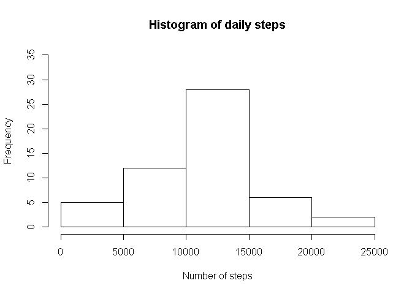
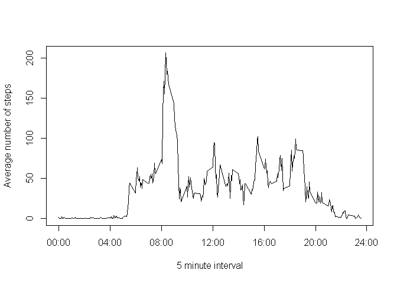
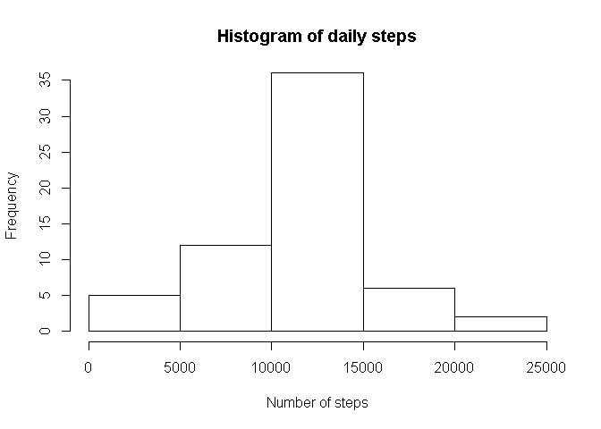
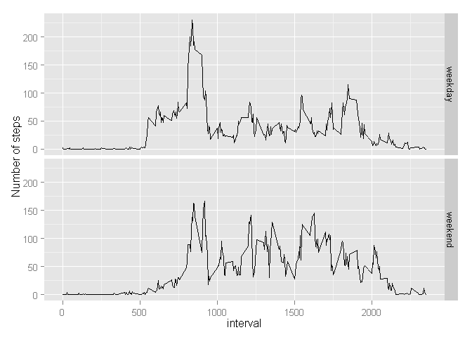

# Reproducible Research Assignment 1
Ricardo A.  
Saturday, November 15, 2014  

###INTRODUCTION

It is now possible to collect a large amount of data about personal movement using activity
monitoring devices such as a Fitbit, Nike Fuelband, or Jawbone Up. These type of devices are part
of the "quantified self" movement -- a group of enthusiasts who take measurements about
themselves regularly to improve their health, to find patterns in their behavior, or because they are
tech geeks. But these data remain under-utilized both because the raw data are hard to obtain and
there is a lack of statistical methods and software for processing and interpreting the data.
This assignment makes use of data from a personal activity monitoring device. This device collects
data at 5 minute intervals through out the day. The data consists of two months of data from an
anonymous individual collected during the months of October and November, 2012 and include the
number of steps taken in 5 minute intervals each day.

###DATA

The data for this assignment can be downloaded from the course web site:

- Dataset: Activity monitoring data [52K]

The variables included in this dataset are:

- steps: Number of steps taking in a 5-minute interval (missing values are coded as NA )
- date: The date on which the measurement was taken in YYYY-MM-DD format
- interval: Identifier for the 5-minute interval in which measurement was taken

The dataset is stored in a comma-separated-value (CSV) file and there are a total of 17,568 observations in this dataset.

###ASSIGNMENT

This assignment will be described in multiple parts. You will need to write a report that answers the
questions detailed below. Ultimately, you will need to complete the entire assignment in a single R
markdown document that can be processed by knitr and be transformed into an HTML file.
Throughout your report make sure you always include the code that you used to generate the output
you present. When writing code chunks in the R markdown document, always use echo = TRUE so
that someone else will be able to read the code. This assignment will be evaluated via peer
assessment so it is essential that your peer evaluators be able to review the code for your
analysis.
For the plotting aspects of this assignment, feel free to use any plotting system in R (i.e., base,
lattice, ggplot2)
Fork/clone the GitHub repository created for this assignment. You will submit this assignment by
pushing your completed files into your forked repository on GitHub. The assignment submission will
consist of the URL to your GitHub repository and the SHA-1 commit ID for your repository state.
NOTE: The GitHub repository also contains the dataset for the assignment so you do not have to
download the data separately.

####Loading and preprocessing the data

Show any code that is needed to

1. Load the data (i.e. read.csv() )


```r
data1<-read.csv("activity.csv")
```

2. Process/transform the data (if necessary) into a format suitable for your analysis


```r
data2<-data1[complete.cases(data1),]
```

We are creating a new data set with the information from only complete cases

####What is mean total number of steps taken per day?

For this part of the assignment, you can ignore the missing values in the dataset.

1. Make a histogram of the total number of steps taken each day


```r
library(dplyr)
```

```
## 
## Attaching package: 'dplyr'
## 
## The following objects are masked from 'package:stats':
## 
##     filter, lag
## 
## The following objects are masked from 'package:base':
## 
##     intersect, setdiff, setequal, union
```

```r
grp <- group_by(data2, date)
histo<-summarise(grp, total=sum(steps,na.rm=TRUE))
hist(histo$total,main="Histogram of daily steps",xlab="Number of steps",ylim=c(0,35))
```

 

We use functions from library Dplyr for grouping and summarizing data. The limits of the Y axis are adjusted so we can compare plots later.

2. Calculate and report the **mean** and **median** total number of steps taken per day


```r
summarise(histo, mean=mean(total),median=median(total))
```

```
## Source: local data frame [1 x 2]
## 
##    mean median
## 1 10766  10765
```

####What is the average daily activity pattern?

1. Make a time series plot (i.e. type = "l" ) of the 5-minute interval (x-axis) and the average number of steps taken, averaged across all days (y-axis)


```r
group2 <- group_by(data2, interval)
tseries1 <- summarise(group2, average=mean(steps))
plot(tseries1,type="l",xlab="5 minute interval",ylab="Average number of steps",xaxt="n")
axis(1,c(0,400,800,1200,1600,2000,2400) ,labels=c("00:00","04:00","08:00","12:00","16:00","20:00","24:00"))
```

 

Again, we use Dplyr functions to summarize data. The tick marks and labels of the X axis of the plot are moodified for a cleaner plot.

2. Which 5-minute interval, on average across all the days in the dataset, contains the maximum number of steps?


```r
tseries1[which(tseries1$average==max(tseries1$average)),]
```

```
## Source: local data frame [1 x 2]
## 
##     interval average
## 104      835   206.2
```

####Imputing missing values

Note that there are a number of days/intervals where there are missing values (coded as NA ). The presence of missing days may introduce bias into some calculations or summaries of the data.

1. Calculate and report the total number of missing values in the dataset (i.e. the total number ofrows with NA s)


```r
sum(!complete.cases(data1))
```

```
## [1] 2304
```

2. Devise a strategy for filling in all of the missing values in the dataset. The strategy does not need to be sophisticated. For example, you could use the mean/median for that day, or the mean for that 5-minute interval, etc.

**The chosen strategy for filling in missing values is to use the mean for existing
5-minute intervals. In the case of intervals with no data, a value of zero is assumed**

3. Create a new dataset that is equal to the original dataset but with the missing data filled in.


```r
data3 <- data1
df1<-data.frame(as.integer(seq(0,2355,5)),rep.int(0, 472))
names(df1) <- c("interval","steps")
df1$steps<-tseries1[match(df1$interval,tseries1$interval),2]
df1$steps[is.na(df1$steps)] <- 0
data3$steps[is.na(data3$steps)]=df1[match(data3$interval,df1$interval),2]
```

We create a new "empty" data frame with "interval" and "steps" columns. Then we construct a lookup table (df1). The last step is to process the new dataset with the lookup table to fill the missing values.

4. Make a histogram of the total number of steps taken each day and Calculate and report the **mean** and **median** total number of steps taken per day. Do these values differ from the estimates from the first part of the assignment? What is the impact of imputing missing data on the estimates of the total daily number of steps?


```r
library(dplyr)
grp3 <- group_by(data3, date)
histo2<-summarise(grp3, total=sum(steps,na.rm=TRUE))
hist(histo2$total,main="Histogram of daily steps",xlab="Number of steps",ylim=c(0,35))
```

 

```r
summarise(histo2, mean=mean(total),median=median(total))
```

```
## Source: local data frame [1 x 2]
## 
##    mean median
## 1 10766  10766
```

We use again Dplyr to summarize data. The Y axis limits of the plot is set to (0,35), same as the first plot, so we can compare at the same scale. The mean is the same as the first dataset but the median is impacted slightly. The histogram shows that there are more days with total number of steps in the range 10,000-15,000.

####Are there differences in activity patterns between weekdays and weekends?

For this part the weekdays() function may be of some help here. Use the dataset with the filled-in missing values for this part.

1. Create a new factor variable in the dataset with two levels -- "weekday" and "weekend" indicating whether a given date is a weekday or weekend day.


```r
data3<-mutate(data3,day=ifelse(as.POSIXlt(data3$date)$wday==0 | as.POSIXlt(data3$date)$wday==6 ,"weekend","weekday"))
data3$day<-factor(data3$day)
```

We test for saturdays (0) and sundays (6) to create a new column in the dataset with values "weekday" and "weekend"

2. Make a panel plot containing a time series plot (i.e. type = "l" ) of the 5-minute interval (x-axis) and the average number of steps taken, averaged across all weekday days or weekend days


```r
library(ggplot2)
group3 <- group_by(data3, interval,day)
tseries2 <- summarise(group3, average=mean(steps))
p <- ggplot(tseries2, aes(interval, average)) + geom_line() + ylab("Number of steps")
p + facet_grid(day ~ .)
```

 

We use the ggplot2 library to quickly create a combined plot. The plots show that the subject of this experiment gets up later on weekends. Also on weekdays there are more steps recorded in the morning hours compared to the weekends. Bed time is earlier on weekdays than weekend.
